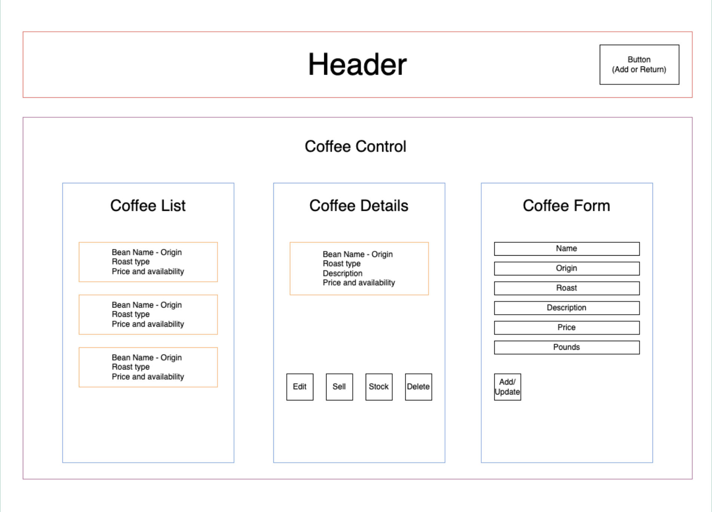

# JavaScript Joe's Java Shop

#### A website to view and update a coffee inventory, built with JavaScript & React

#### By Lindsay Warr

## Technologies Used

* Git
* JavaScript
* React
* HTML & CSS

## Description

This is a React web application featuring full CRUD functionality that tracks the inventory of coffee beans for a local shop. When running the application, a static list of beans is displayed as well as an option to add a new bean type. From the starting page, the user can click on a type of bean, and more details are displayed. The user will also have the option to edit or delete the bean info entirely. When clicking "Buy" the bean count is decremented by 1 pound. When clicking "Restock" the bean count is incremented by 1 pound.

## Component Diagram



## Setup/Installation Requirements

1. Clone this project to your local machine using the following command:
```
git clone https://github.com/iamalion/coffee-shop.git
```
2. Open your shell and navigate to this project's production directory named ``coffee-shop``.
3. Run the command `npm install` to install all Node packages and dependencies.
4. run the command `npm run start` to bundle and begin running the project. The app will automatically open in your browser. 

_This project was bootstrapped with [Create React App](https://github.com/facebook/create-react-app)._

## Available Scripts

In the project directory, you can run:

### `npm start`

Runs the app in the development mode.\
Open [http://localhost:3000](http://localhost:3000) to view it in your browser.

The page will reload when you make changes.\
You may also see any lint errors in the console.

### `npm test`

Launches the test runner in the interactive watch mode.\
See the section about [running tests](https://facebook.github.io/create-react-app/docs/running-tests) for more information.

_Note: no test files have been implemented for this project. Visit the above link for information on setting up tests._

### `npm run build`

Builds the app for production to the `build` folder.\
It correctly bundles React in production mode and optimizes the build for the best performance.

The build is minified and the filenames include the hashes.\
Your app is ready to be deployed!

See the section about [deployment](https://facebook.github.io/create-react-app/docs/deployment) for more information.

### `npm run eject`

**Note: this is a one-way operation. Once you `eject`, you can't go back!**

If you aren't satisfied with the build tool and configuration choices, you can `eject` at any time. This command will remove the single build dependency from your project.

Instead, it will copy all the configuration files and the transitive dependencies (webpack, Babel, ESLint, etc) right into your project so you have full control over them. All of the commands except `eject` will still work, but they will point to the copied scripts so you can tweak them. At this point you're on your own.

You don't have to ever use `eject`. The curated feature set is suitable for small and middle deployments, and you shouldn't feel obligated to use this feature. However we understand that this tool wouldn't be useful if you couldn't customize it when you are ready for it.

## Known Bugs

* _No known bugs_

## License
[MIT](LICENSE.txt)

